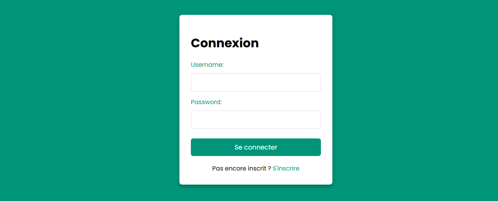

# Projet Django BTS_PY 🐍

## 🎯 Objectif

<p align="justify">
Créer une application web d'inventaire multi-utilisateur avec système d'authentification personnalisé et séparation des bases de données 
entre utilisateurs et données métier. Le gérant du garage Passion & Sens possède un inventaire papier, il prend son carnet pour aller 
chez ses différents fournisseurs. N'étant pas très à l'aise avec l'informatique Pascal le gérant n'a pas souhaité acheter d'ordinateur 
pour cela. Mais aujourd'hui son garage grossi de plus en plus, maintenant le garage compte 3 salariés et le carnet ne pouvant pas 
être dupliqué n'est plus du tout pratique. Il n'aime pas les ordinateurs, mais possède un téléphone avec lequel il est plutôt à l'aise pour
naviguer sur internet. Tous les employés de son garage ainsi que lui-même possèdent un téléphone et une connexion internet, je lui propose
donc un site web pour inventorier ses pièces. Lui et ses employés pourront se connecter à l'application web et accéder à l'inventaire du garage.
Ils peuvent créer de nouvelles listes ou éléments, les consulter, les modifier après s'être connectés à leurs propres comptes pour assurer la traçabilité des modifications. 
Le site web tournera chez moi, sur un serveur moyennant un petit abonnement ce qui lui évitera d'acheter du matériel. À tout moment, il pourra résilier son abonnement
et extraire un fichier CSV de sa base de données.
</p>


## ⚙️ Fonctionnalités principales

- ✅ Authentification personnalisée (`auth_app`)
- 📋 Gestion multi-utilisateur de listes et d’éléments (`elements`)
- 🔓 Affichage de toutes les listes à tous les utilisateurs (pas de restriction sur `user_id`)
- 🔍 Recherche intelligente dans les listes/éléments
- ⏺️ Exportation CSV des inventaires
- 🛡️ Double base de données (SQLite + MySQL)
- 📝 Journalisation (logging) des actions utilisateurs

---

## 🧱 Structure du Projet

- `auth_app` : gestion des utilisateurs (`CustomUser`) stockés dans une base MySQL (`users`)
- `elements_app` : gestion des listes (`List`) et des éléments (`Element`) dans une base SQLite (`default`)
- `database_router.py` : routeur dirigeant les modèles vers la bonne base
- `settings.py` : configuration des bases et du routeur

---

## 🔐 Authentification personnalisée

### `CustomUser`
Modèle utilisateur personnalisé basé sur `AbstractUser` avec stockage dans la base `users`.

Ajout d’un utilisateur :
```python
def connexion(request):
    form = AuthenticationForm(request, data=request.POST or None)

    if request.method == 'POST': # vérifie que l'user est bien en bdd
        username = request.POST.get('username')
        password = request.POST.get('password')
        user = authenticate(request, username=username, password=password)

        if form.is_valid(): # connecte le user
            user = form.get_user()
            login(request, user)
            return redirect('home')
```





---

## 📦 Gestion d’inventaire

- Un `List` contient plusieurs `Element`
- Chaque `List` est liée à un utilisateur via `user_id`
- Chaques `List` peut être supprimée avec ses éléments
- Chaques `Element` peut être modifié ou supprimé

Affichage des listes à tous les utilisateurs :
```python
 list = get_object_or_404(List, slug=list_slug)
```


---

## 🔐 Journaux d'activité (logs)

Toutes les vues critiques génèrent un log dans `logs/elements.log`.  
Le log contient :

- 👤 L'utilisateur
- ⏰ La date/heure (`timezone.now()`)
- 🧾 L'action effectuée

## 🗃️ Bases de données

```python
# settings.py
DATABASES = {
    'default': {  # données métier
        'ENGINE': 'django.db.backends.sqlite3',
        'NAME': BASE_DIR / 'db.sqlite3',
    },
    'users': {  # utilisateurs
        'ENGINE': 'django.db.backends.mysql',
        'NAME': 'auth_users',
        'USER': 'root',
        'PASSWORD': '',
        'HOST': '127.0.0.1',
        'PORT': '3306',
    }
}
```

Routeur :
```python
class AuthRouter:
    def db_for_read(self, model, **hints):
        if model._meta.app_label == 'auth_app':
            return 'users'
        return 'default'
```

---

## 🧩 Diagrammes de classes

### 🔐 `BTS_PY`

```
BTS_PY_BR2/
├── auth_app/               # App dédiée à l'authentification personnalisée
│   ├── views.py            # Vue inscription, connexion, déconnexion
│   └── models.py           # Modèle CustomUser
│
├── elements/               # App de gestion de listes
│   ├── views.py            # Toutes les vues utilisateur (add, delete, export, etc.)
│   ├── models.py           # Modèles List et Element
│   └── templates/elements/ # Templates HTML
│
├── BTS_PY/                 # Config Django principale
│   ├── settings.py         # Définition des bases, routeurs, logs
│   ├── urls.py             # Routage des apps
│   └── db_router.py        # Redirection des modèles vers les bonnes bases
│
├── db.sqlite3              # Base principale SQLite
├── manage.py
└── logs/elements.log       # Fichier log créé automatiquement
```

### 🔐 `auth_app`

```mermaid
    class CustomUser {
        +username : str
        +email : str
        +password : str
        +is_staff : bool
        +is_superuser : bool
    }
    CustomUser --> Group
    CustomUser --> Permission
```

### 📦 `elements_app`

```mermaid
    class List {
        +id : int
        +name : str
        +slug : str
        +user_id : int
    }
    class Element {
        +id : int
        +description : str
        +list_id : int
    }
    List --> Element : contient
```

---

## 🚀 Lancement du projet

```bash
python manage.py runserver
```

Utilisateurs et mots de passe sont stockés dans `users`, les listes/éléments dans `default`.

---

## 📎 Auteur
Projet BTS SIO SLAM - 2025  
Développé avec Django 5.1.7 et PyCharm Pro
